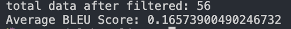
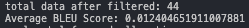
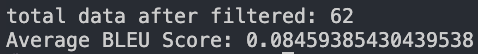

# ECS289L-SmartStudy
Boosting Student Learning with RAG-Powered Insights

## Overview
This project focuses on enhancing student learning by leveraging Retrieval-Augmented Generation (RAG) pipelines. The primary goal is to compare the effectiveness of different RAG models in providing accurate and insightful responses.

## Baseline Model
We use ChatGPT-4 as our baseline model to compare the results with our two proposed models.

## Proposed Models 
1. **Retrieve-then-Generate RAG Pipeline using Langchain and GPT-4 Model**
2. **Retrieve-then-Generate RAG Pipeline using LLAMA Model**
3. **Hybrid RAG Pipeline using Langchain and GPT-4 Model**

## Model Details

### GPT-4 Model
- **Parameters**: Trained on 1.7 trillion parameters.
- **Notes**: Be cautious of hallucinations.
- **Evaluation Metric**: BLEU Score

### LLAMA-3 8B Model
- **Parameters**: Trained on 8 billion parameters.
- **Notes**: Be cautious of hallucinations.
- **Evaluation Metric**: BLEU Score

## Results
### Baseline Model (ChatGPT-4)
- **BLEU Score**: 

### Langchain + GPT-4 Model + Retrieve-then-generate
- **BLEU Score**: 

### LLAMA-3 Model + Retrieve-then-generate
- **BLEU Score**: 

### Hybrid Model (Langchain + GPT-4)
- **BLEU Score**: 

## Future Work
1. Explore better RAG pipelines such as Dense Passage Retrieval (DPR).
2. Address computational limitations for training larger models.

## How to Run
1. Clone the repository:
   ```sh
   git clone https://github.com/your-repository/ecs289L-SmartStudy.git
   cd ecs289L-SmartStudy
2. Install dependencies:
    ```sh
    pip install -r requirements.txt
3. Run the setup script for your models:
    ```sh
    python setup.py #This depends on which model you running
4. Use the query script to evaluate the models:
    ```sh
    python query.py

## Contributions
- Saisha Shetty
- Yu-Jie Wu
- Jayesh Chhabra
